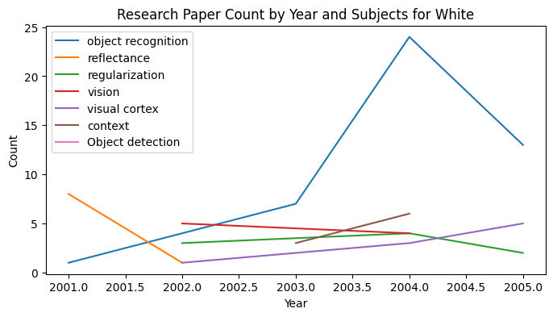

# wang-ml-sample

## Structure of repository:
At the top level, this repo contains two folders:

1. **scripts:** this sub-folder contains all the python code (in jupyter notebooks) written to accomplish tasks 1-4. [Check here](scripts) 

2. **data:** this sub-folder contains csv files that were either sourced from the web, or were created as intermediate dataframes for analysis. [Check here](data)

3. **other files:**
- datatask pdf
- images used in readme
- poetry environment setup files

For every task in the assingment, I have covered the following five things: 
1. High-level approach to the problem 
2. Technical Decisions & Key Tradeoffs
3. Sequence of steps to implement solution
4. Scripts written that can be found in the scripts folder 
5. Data collected that can be found in the data folder

Limitations have been mentioned wherever necessary.

## Task 1:
**Compile a sample of 400 papers from MIT’s Computer Science and Artificial Intelligence Lab.**
* URL: https://dspace.mit.edu/handle/1721.1/5458/browse?type=dateissued
* Timeframe: focus on year 2000 to today.

**Approach to the problem**:
To compile 400 papers from the web, I broke down the process into the following 3 steps:
1. Starting the year 2000, get research paper URLs and metadata URLs for every paper. Save this data for every page in a csv file
2. Using the metadata links, fetch all the metadata provided
3. Sample 400 research papers based on different criteria (pick _n_ from certain years or select based on _subject_ availability)

**Technical Decisions & Key Tradeoffs:** 
1. How to Sample 400 papers: (do it initially or later given)
    * Sampling impacts ability to iterate / experiment with more data 
    * Data size can be impacted by server limits

Based on these factors, I tried the following three technical implementations:
1. **Scraping everything using _requests_:** This failed because _requests_ does not handle the issue of _timeouts_ well. 

2. **Limiting scraping data; collection using AWS lambda:** To deal with failed server requests, I considered using _pagination-info_, i.e. the fact that results for year 2000 onwards exist from _2708_ to _3804_. I tried using this, along with AWS lambda to send requests in parallel. In this design, I would have chosen equally distributed intervals of say, 20 or 40 between _2708_ and _3804_ and used those to send requests through AWS. I didn't end up doing this because metadata across years didn't seem consistent, so I did not want to lose important data, and setting up AWS was time-consuming.

3. **Isolating link collection and metadata scraping using Selenium:** Selenium resolved the problem of _server-timeouts_. Once I tested that out, I broke down functions such that we would scrape all links first, save them page by page, and then go through each to collect metadata. By isolating processes this way, I was able to debug better, and explore data much better. The only drawback of this solution was collecting so much data took time. However, this one was a one-time problem.

**Folder Navigation:** 
1. scripts:
    * [getting research paper links](wang-ml-sample/scripts/compiling_paper_links.ipynb)
    * [fetching metadata](wang-ml-sample/scripts/fetch_metadata.ipynb)
    * [sampling 400 papers](wang-ml-sample/scripts/metadata_sampling.ipynb)
2. data:
    * [paper_links](wang-ml-sample/data/paper_links) 
    * [metadata](wang-ml-sample/data/metadata) 

**Sequence of Steps**
- Downloaded research paper links and metadata links, page by page. Script [here](wang-ml-sample/scripts/compiling_paper_links.ipynb); data [here](wang-ml-sample/data/paper_links) 
- Aggregated research paper links in one csv for exploration. Data [here](wang-ml-sample/data/paper_links/all_research_paper_links.csv)
- Downloaded metadata for research papers, page by page. Script [here](wang-ml-sample/scripts/fetch_metadata.ipynb); data [here](wang-ml-sample/data/metadata)
_ Sampled 400 papers using 2 methods: picking 25 random papers from 16 years and picking the ones with non-null values of _subject_ first. Script [here](wang-ml-sample/scripts/metadata_sampling.ipynb)

## Task 2:
**Categorize each author’s nationality or ethnicity.**

**Approach to the problem:**
For this problem, the approach was simple: look at the column _dc.contributing.author_, split the names and find a way to leverage the _last-name_. 

**Technical Decisions & Key Tradeoffs:** 
1. Dataframe structure:
    * Creating and saving separate dataframe for authors (more space vs. isolation)

2. Modelling / Predicting ethnicity:
    * Using cosine similarity to find similar last_names from Census vs. other ML models (simplicity and incomplete vs. time-consuming but more concrete findings)

Based on these two factors, I tried the following technical implementations:
1. **Isolating intermediate dataframe:** I created a separate dataframe for authors, where one row is an author. The key design principles here are isolation and efficiency - once we have relevant columns just for authors, we can conduct author specific analysis more easily

2. **Modelling / Predicting ethnicity:** For this, I tried working with the python package _ethnicolr_. However, I faced errors in package management, so I used the US Census data, tried to find closest matches of author names to Census names and assign an ethnicity accordingly. Specific steps are mentioned below.

**Folder Navigation:** 
1. scripts:
    * [predicting ethnicity for authors using Census](wang-ml-sample/scripts/metadata_analysis_authors.ipynb)

2. data:
    * [aggregated author dataframe](wang-ml-sample/data/authors/authors.csv)
    * [aggregated author dataframe with ethnicity](wang-ml-sample/data/authors/authors_ethnicity.csv)
    * [2010 census names](wang-ml-sample/data/census_names)

**Sequence of Steps**
- Downloaded names from a 2010 US Census dataset that covers _Frequently Occurring Surnames in the 2010 Census: Surnames Occurring at Least 100 Times Nationally._ This data has a list of ~160K names. For each _lastname_, they provide a breakdown of lastnames observed in given ethnicities:

| Column Name | Description                                                                                   |
|-------------|-----------------------------------------------------------------------------------------------|
| pctwhite    | Percent Non-Hispanic White Alone                                                              |
| pctblack    | Percent Non-Hispanic Black or African American Alone                                          |
| pctapi      | Percent Non-Hispanic Asian and Native Hawaiian and Other Pacific Islander Alone               |
| pctaian     | Percent Non-Hispanic American Indian and Alaska Native Alone                                  |
| pct2prace   | Percent Non-Hispanic Two or More Races                                                        |
| pcthispanic | Percent Hispanic or Latino origin                                                             |

All of these values add up to 100%. 
- For each _lastname_, I assigned an ethnicity based on the highest value observed in columns above. So, for example, for the _lastname_ **Smith**, the _pctwhite_ value is **70.9**, so Smith is assigned the ethnicity White. 

- Then, I found _most-similar_ matches to author names in Census names using _cosine similarity_. 
- Finally, I assigned the ethnicity of the _most similar_ last name to the author. All these steps are [here](wang-ml-sample/scripts/metadata_analysis_authors.ipynb)

**Limitations:**
1. The US Census database used for this analysis only has 6 meaningful ethnic divisions as shown above. _Ethnicolr_ has a lot more divisions, which would provide more insight, especially because many White names have European origins. 

## Task 3:
**Categorize research topics: sub-categories within AI (e.g. facial recognition, speech recognition)**

**Approach to the problem:**
I looked at the following 3 columns to get some idea of relevant AI topics: _dc.subject_, _dc.title_ and _dc.dc.description.abstract_. Using these columns, I examined: 
* frequently occuring _subject names_, 
* n-grams in papers abstract, 
* topics in papers abstract

and finally used a pre-trained bart model with zero-shot classification to assign topic labels to each research paper.

**Technical Decisions & Key Tradeoffs:** 
1. Dataframe structure:
    * Creating and saving separate dataframe for subjects (more space vs. isolation)

2. Labelling / aggregating sub-topics 
    * Using an interative approach (EDA + manual analysis -> Labels -> Assignment using pre-trained models) vs. using more complex ML approaches using _description_

Based on these two factors, I tried the following technical implementations:
1. **Isolating intermediate dataframe:** Similar to the approach taken for authors, I created a separate dataframe for subjects, where one row is a subject. Again, the key design principles here are isolation and efficiency. 

2. **Labelling/Aggregating sub-topics:** In my sampling design, I selected 400 research papers by giving priority to papers that have non-null values for _subject_, however, I designed all functions such that this dataframe can be replaced by any other selection of 400 papers and the code would still work. For this specific sample though, I first filtered for _subjects_ (~200 rows) that contained _AI_ and examined a plot of topics for those rows like so:

Then with the entire dataset of 400 rows (research papers), I used the _title_ and _description_ columns to check tf-idf scores (normalized frequency counts) of tokens (words), conducted topic modelling using LDA, and examined uni/bi/tri grams, which gave some idea around the topics. However, with these approaches, apart from _object detection or computer vision based techniques_, no other traditional sub-bucket of AI very clearly jumped out. 

Finally, based on observations from the exploratory approaches mentioned above, I defined the following labels: _Object Recognition/Detection, Image Classification, Face Detection, Language Models, Speech/Audio Recognition, Robotics, High Performance Computing, Privacy / Ethics_ and used a pre-trained bart-model to classify research papers using zero-shot classification (no training data to test correctness). 

**Folder Navigation:** 
1. scripts:
    * [predicting sub-categories of AI subjects](wang-ml-sample/scripts/metadata_analysis_subjects.ipynb)

2. data:
    * [initial dataframe for subjects](wang-ml-sample/data/subjects/subjects_simple.csv)
    * [final classfication of subjects](wang-ml-sample/data/subjects/subjects_classification_using_bert.csv)

**Sequence of Steps:**
I have largely mentioned the sequence in **Labelling/Aggregating sub-topics** above. After using zero-shot classificaton on all 400 papers and labels from EDA, I obtained the following:

**Limitations:**
1. During EDA, I observed that most research abstracts are heavy on language pertaining to mathematical approaches and/or modelling, which doesn't neatly translate to the application. A mapping like that would have helped in coming up with better labels and assigning them to papers.  

## Task 4:
**Identify patterns of nationality/ethnicity and research topics within AI across time**

**Notes:**
For this task, I used the dataframes created in steps 2 and 3, and created the following sample visuals:

The script is straightforward and present [here](wang-ml-sample/scripts/metadata_analysis_aut_sub.ipynb) 

## Task 5 and 6:
While I did not implement these tasks, the high-approach I would have taken for these would have been:
1. Use Google APIs to search for queries like: _authorname + faculty_ or _authorname + google scholar_. The former is likely to give information on their appointments outside faculty while the later is likely to help with Task 6 (trajectory before and after industry appointments) 
2. With or without step 1, I would have most likely, scraped data from engineering department websites of top US universities 
3. University websites typically have notes on faculty work experience (career trajectories outside academia). I would also try to download their CVs (from the University webpage) and scrape data from those. I would deprioritize LinkedIn (because of API limits) / news (lack of standardization). 

Time I would potentially need for Tasks 5 and 6: 2 days to design a scalable approach that works